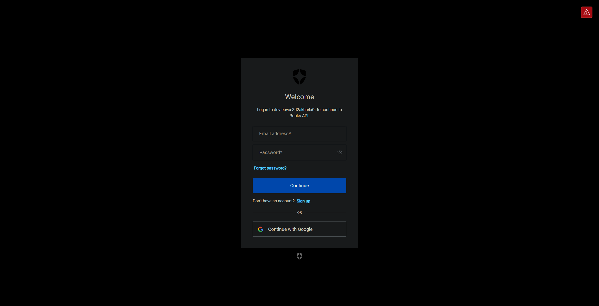
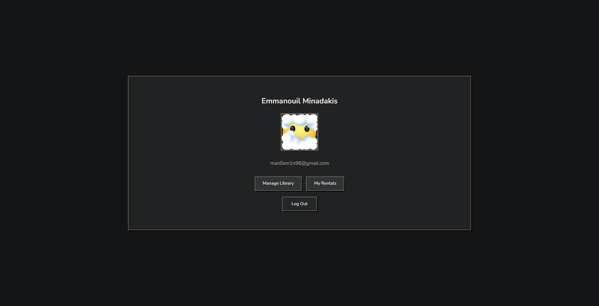
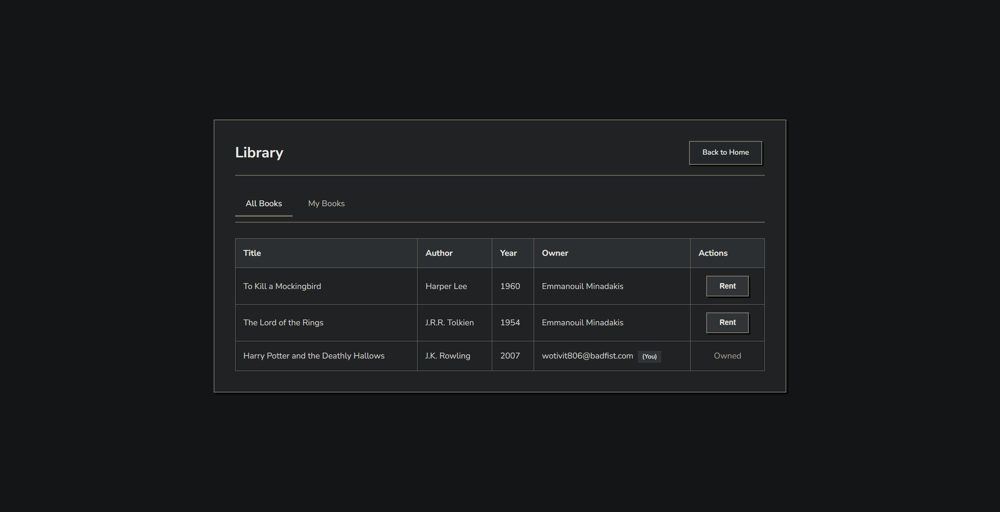
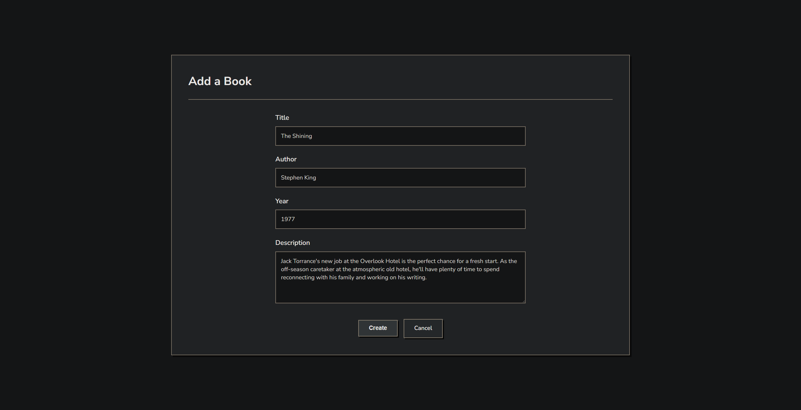
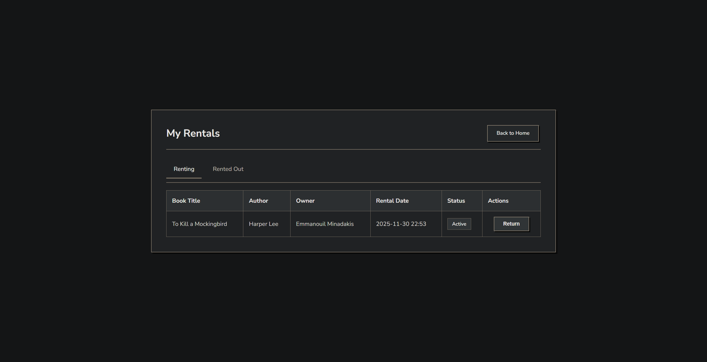
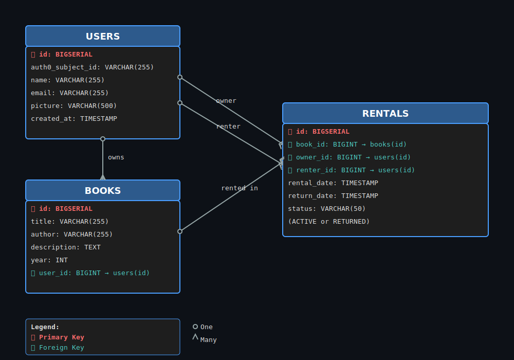

# MVC Bookstore Application


A typical MVC application for bookstore management with OAuth 2.0 authentication.

## Tech Stack

- **Spring Boot 3.5.8** - Spring Data JPA, Spring Security, OAuth 2.0
- **PostgreSQL** - NeonDB cloud database
- **Auth0** - OAuth2 authentication provider
- **Thymeleaf** - Server side templating engine
- **Flyway** - Database migrations
- **MapStruct** - DTO mapping
- **Lombok** - Boilerplate reduction
- **Maven** - Build tool
- **Java 21** - LTS version

## Features

- OAuth2 authentication (Auth0/Google)
- CRUD operations for books
- Book rental system with status tracking
- User specific collections
- Caching for performance
- Database migrations with Flyway

## Screenshots

### Login (Auth0)


### Home


### Library


### Create Book


### Rental History


## Database Schema



## Folder Structure

```
src/
├── main/
│   ├── java/com/example/bookstore/
│   │   ├── controllers/    # Controllers
│   │   ├── services/       # Business logic
│   │   ├── repositories/   # Data access layer
│   │   ├── entities/       # JPA entities
│   │   ├── models/         # DTOs
│   │   ├── mappers/        # MapStruct mappers
│   │   ├── enums/          # Enumerations
│   │   ├── config/         # Security configuration
│   │   └── middleware/     # Exception handler
│   └── resources/
│       ├── db/migration/   # Flyway scripts
│       ├── templates/      # Views
└──       └── static/css/   # CSS
```
